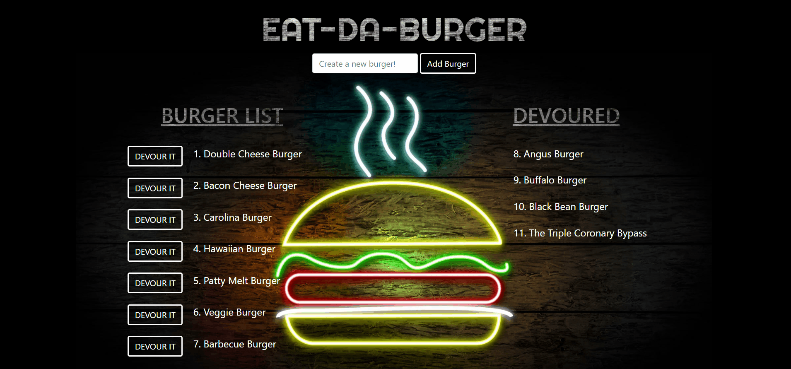

# EAT-DA-BURGER

The purpose of *Eat-Da-Burger* is to showcase the Full Stack implementation of [Node.js](https://nodejs.org/en/), 
[Express](https://expressjs.com/), [Handlebars](https://www.npmjs.com/package/express-handlebars), an ORM, and [MySQL](https://www.mysql.com/). The application allows the user 

Click [here](https://eat--da--burger.herokuapp.com/) to view the application!


## Installation 

1. Clone this repo - https://github.com/ChrisBoyce886/eat-da-burger.git
2. Run `npm install` command from the root directory
3. Set the `PORT` environment variable within `server.js` file to the number of your choice. `3000` is set as the default. 
Example: `var PORT = process.env.PORT || 3000`
4. Run `node server.js` command from the root directory
5. Navigate to your browser and enter `localhost:3000`(Or your preferred PORT number)


## Design Notes

* The application allows the user to see "Burgers available" and "Burgers already devoured" which are stored on a MySQL database.
* The user can then add a burger to the list to be "devoured". 
* The application makes use of Node, Express, Express-Handlebars, an ORM, MySQL, and several NPM packages. 
     
## Demonstration gif:

* This gif demonstrates how to add burgers and "devour" burgers on the application. 
   


     
## Built With

* [Node.js](https://nodejs.org/en/docs/)
* [MySQL Database](https://www.mysql.com/)
* JavaScript
* HTML5
* CSS3

**NPM Packages:**

* [Express](https://www.npmjs.com/package/express)
* [Express-Handlebars](https://www.npmjs.com/package/express-handlebars)
* [mysql](https://www.npmjs.com/package/mysql)
* [Body-Parser](https://www.npmjs.com/package/body-parser)
* [Method Override](https://www.npmjs.com/package/method-override)

## File Structure 

```
.
├── config
│   |── connection.js
|   └── orm.js
│ 
├── controllers
│   └── burgers_controller.js
│
├── db
|   |──schema.sql
|   └── seeds.sql
|
├── models
│   └── burger.js
│ 
├── node_modules
│ 
├── public
│   └── assets
│       ├── css
│       │   └── style.css
│       └── imgages
│           └── ...      
│
├── views
|    ├── index.handlebars
|    └── layouts
|         └── main.handlebars
|
├── package.json
|
├── server.js
```

